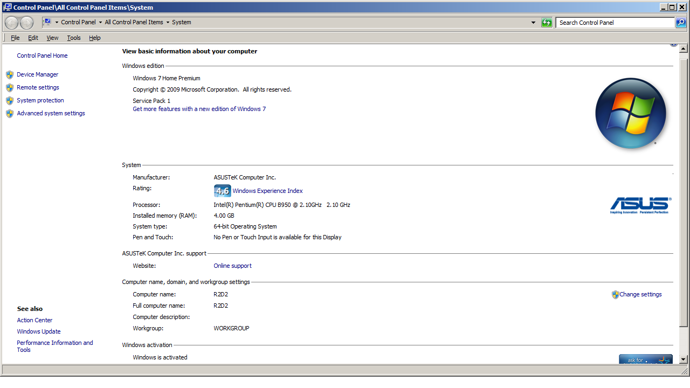

# Michigan State Boot Camp: Data Analytics Self-Assessment
Final Push to the Finish Line! June 2022

## Summary

### Final Project
For the class final project, I took somewhat of an initial backseat to the 3 NBA enthusiasts who had lots of information and insight to share; almost too much! After a few debates on how to focus all this energy, I settled into the role of working with Tiana on using Python & Pandas to process our chosen dataset for machine learning.

Outside this constructive Python coding pairing, I checked the R code that was being written to test for execution on my system.

### Personal Challenges
From the onset, I faced a massive technical challenge: pursing the course on a nearly decade old laptop that was under recommended specs, a Windows 7 laptop with half the recommended RAM coupled with the desire to utilize long paid-for MS Office 10. This choice resulted in the version of MS Office I utilized not having a convenient Box-and-whiskers plot feature.

Installation of Anaconda, PG Admin and Tableau Public all presented a challenge due to Windows 7 being dropped from the latest installation packages. Google searching and Youtube vides for last working Windows 7 installation package for the aforementioned programs solved many of the issues. 

A second personal challenge encountered was a choice to pursue an employment promotion which constituted 5 weeks of intensive training. This setback was recouped by a week of earned vacation to rapidly catch up. Well worth it!

